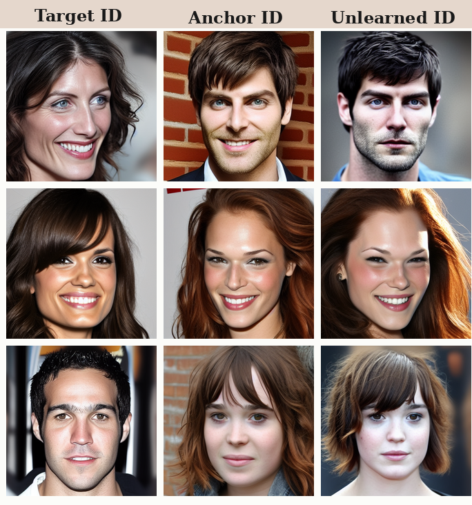
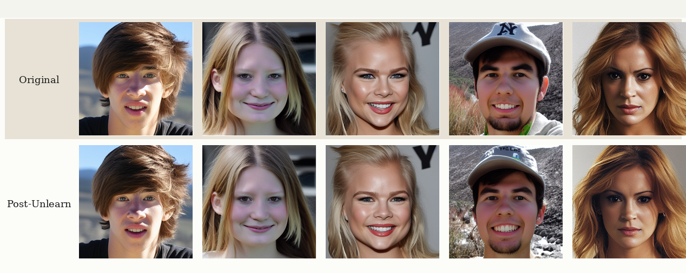

# PIU

Official implementation of [PIU: Proximity-guided Identity Unlearning in ID-Conditioned Diffusion Models](https://arxiv.org/abs/2605.22311), IJCB 2026.

PIU unlearns a target identity in Arc2Face by redirecting it toward an anchor identity selected in the ArcFace embedding space, while preserving other identities.

The repository contains:

- PIU training with proximity-based anchor selection.
- Data preparation tools to download the published embeddings or recompute them from CelebA-HQ images.
- A before/after demo with identity evaluation, training curves, and result visualization.

## Qualitative results

<p align="center">
  
</p>

PIU examples: target identity (left), selected anchor (middle), and generation after unlearning (right).



Retained identities before (top) and after (bottom) unlearning a target identity. These examples illustrate preservation of identities outside the forget set.

## Install

Run from the repository root. The locked environment targets Linux with an NVIDIA GPU and CUDA support.

```bash
conda create --name piu python=3.10 pip -y
conda activate piu
export PYTHONNOUSERSITE=1
python -m pip install --upgrade pip setuptools wheel
python -m pip install -r requirements-lock.txt
python -m pip install --no-deps -e .
```

## Prepare embeddings

Choose either option below. Both prepare the embeddings, identity labels, centroids, and face models needed by the demo.

### Option 1: Use the paper embeddings

Download the exact artifacts used in the paper from [Hugging Face](https://huggingface.co/datasets/edgarcancinoe/celebahq_512_id_clusters).

```bash
piu-prepare-data --output-dir data/celebahq_512
piu-demo --identity-id 512 --data-dir data/celebahq_512 --use-anchor-overrides
```

`--use-anchor-overrides` reuses the exact recorded paper anchor selections where available. Omit it to select anchors automatically based on proximity.

### Option 2: Regenerate embeddings

Download the CelebA-HQ images from the same dataset, extract ArcFace embeddings, and recompute identity clusters + normalized centroids:

```bash
piu-recompute-data --output-dir data/celebahq_512_recomputed --device cuda
```

The default clustering uses DBSCAN with cosine distance, `eps=0.35`, and `min_samples=2`; noise samples become singleton identities. Extraction is cached per shard, so rerunning the command reuses completed shards. Use `--device cpu` for CPU extraction.

To run extraction and clustering separately:

```bash
piu-recompute-data --output-dir data/celebahq_512_recomputed --device cuda --stage embeddings
piu-recompute-data --output-dir data/celebahq_512_recomputed --stage clusters --eps 0.35 --min-samples 2
```

Recomputed identity IDs may differ from the paper IDs. Inspection of the generated IDs and sample counts may be needed before choosing a desired target:

```bash
python -c "import numpy as np; ids, counts = np.unique(np.load('data/celebahq_512_recomputed/labels.npy'), return_counts=True); print(list(zip(ids.tolist(), counts.tolist())))"
```

Run the demo with an ID from those labels, replacing `YOUR_ID` below. Do not use `--use-anchor-overrides` with recomputed data.

```bash
piu-demo --identity-id YOUR_ID --data-dir data/celebahq_512_recomputed --output-dir outputs/recomputed_demo
```

`metadata.json` records the extraction and clustering settings and the adjusted Rand index against the published partition. 

## Demo outputs

Results are written to `outputs/demo` unless `--output-dir` is set. Each run saves the resolved configuration, data split, U-Net checkpoint, before/after images, and evaluation metrics. Training curves and aligned comparison grids are saved under `summary/`.

Identity similarity (ISM) is evaluated every 50 optimizer steps by default. Use `--evaluation-every 0` to disable intermediate evaluation, or pass another interval. See `piu-demo --help` for the remaining options.

## License and acknowledgments

PIU code is released under the [MIT License](LICENSE). This implementation builds on [Arc2Face](https://github.com/FoivosPar/Arc2Face) and uses InsightFace for face embeddings. The [Arc2Face license](src/piu_unlearning/models/ARC2FACE_LICENSE) is included for the adapted code. Pretrained models and datasets remain subject to their respective licenses and terms of use.

## Citation

```bibtex
@inproceedings{hernandezcancinoestrada2026piu,
  title = {{PIU}: Proximity-guided Identity Unlearning in {ID}-Conditioned Diffusion Models},
  author = {Hernandez Cancino Estrada, Jose Edgar and D{\'i}az Lupone, Mauro and Emer{\v{s}}i{\v{c}}, {\v{Z}}iga and {\v{S}}truc, Vitomir and Peer, Peter and Toma{\v{s}}evi{\'c}, Darian},
  booktitle = {IEEE/IAPR International Joint Conference on Biometrics (IJCB)},
  year = {2026},
  eprint = {2605.22311},
  archivePrefix = {arXiv},
  primaryClass = {cs.CV},
  url = {https://arxiv.org/abs/2605.22311}
}
```
